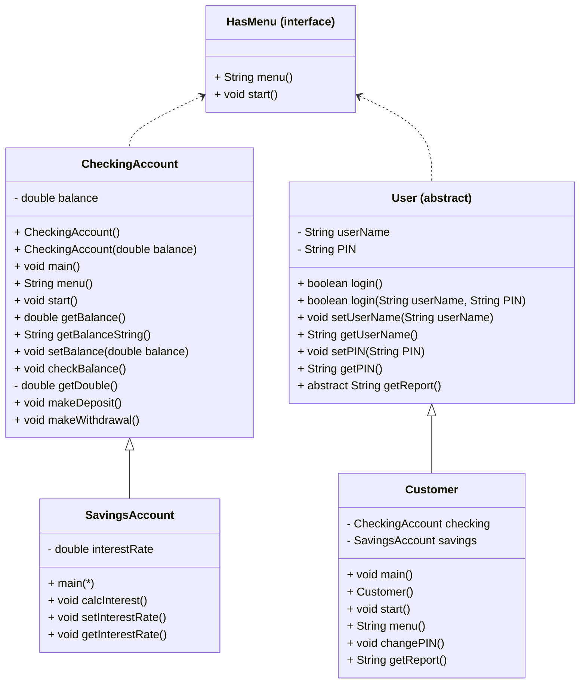

# Algorithm for Bank On It project
## Mermaid diagram

## Algorithm for CheckingAccount
### CheckingAccount()
1. set balance to 0.0
### CheckingAccount(double balance)
1. set this.balance to balance
### void main()
1. start();
### void start()
1. String choice = "";
1. boolean keepGoing = true;
1. while (keepGoing)
	1. choice = menu();
	1. if (choice.equals("0"))
		1. keepGoing = false;
	1. else if (choice.equals("1"))
		1. print "Checking balance..."
		1. checkBalance();
	1. else if (choice.equals("2"))
		1. print "Making a deposit..."
		1. print "How much to deposit?"
		1. setBalance(balance + getDouble());
		