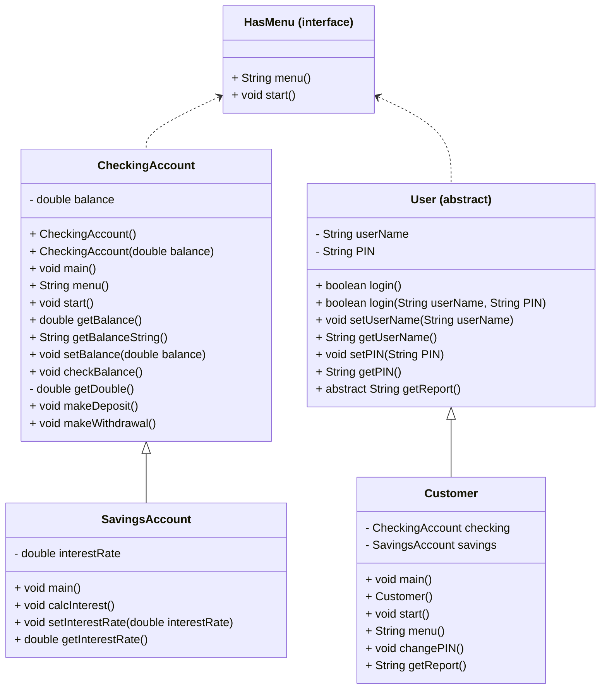

# Algorithm for Bank On It project
## Mermaid diagram

## Algorithm for CheckingAccount
1. implements HasMenu, Serializable
### CheckingAccount()
1. set balance to 0.0
### CheckingAccount(double balance)
1. set this.balance to balance
### static void main(String[] args) 
// for testing
1. CheckingAccount c = new CheckingAccount();
1. c.start();
### void start()
1. String choice = "";
1. boolean keepGoing = true;
1. while (keepGoing)
	1. choice = menu();
	1. if (choice.equals("0"))
		1. keepGoing = false;
	1. else if (choice.equals("1"))
		1. checkBalance();
	1. else if (choice.equals("2"))
		1. makeDeposit();
	1. else if (choice.equals("3"))
        1. makeWithdrawal();
    1. else
        1. print "Invalid input, please try again."
    1. end if
1. end while
### double getBalance()
1. return balance;
### String getBalanceString()
1. return String.format("$%.2f", balance);
### void checkBalance()
1. print "Checking balance..."
1. print "Current balance: " + getBalanceString();
### double getDouble() 
(**private** method to error handle user inputting doubles)
1. try
    1. create Scanner for user input called input
    1. put user input into a string called stringInput
    1. convert input into a double with Double.parseDouble(stringInput)
    1. return userInput
1. catch (Exception e)
    1. print "Invalid input, please try again"
    1. return 0.0;
1. end try
### void makeDeposit()
1. print "Making a deposit..."
1. print "How much to deposit?"
1. add getDouble() to balance
1. print out new balance
### void makeWithdrawal()
1. print "Making a withdrawal..."
1. print "How much to withdraw?"
1. subtract getDouble() from balance
1. print out new balance
## Algorithm for SavingsAccount
1. extends CheckingAccount, implements HasMenu
### static void main(String[] args)
// for testing
1. SavingsAccount a = new SavingsAccount();
1. a.start();
### void calcInterest()
1. double interest = balance * interestRate
1. set balance to balance + interest
### void setInterestRate(double interestRate)
1. this.interestRate = interestRate;
### double getInterestRate()
1. return interestRate;
