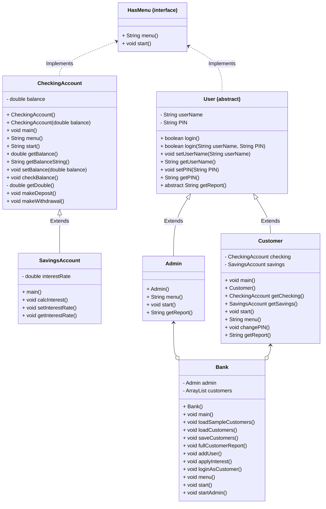

# Algorithm for Bank On It project
## Mermaid diagram

## Algorithm for CheckingAccount
implements HasMenu, Serializable
### CheckingAccount()
1. set balance to 0.0
### CheckingAccount(double balance)
1. set this.balance to balance
### static void main(String[] args) 
(for testing)
1. CheckingAccount c = new CheckingAccount();
1. c.start();
### void start()
1. String choice = "";
1. boolean keepGoing = true;
1. while (keepGoing)
	1. choice = menu();
	1. if (choice.equals("0"))
		1. keepGoing = false;
	1. else if (choice.equals("1"))
		1. checkBalance();
	1. else if (choice.equals("2"))
		1. makeDeposit();
	1. else if (choice.equals("3"))
        1. makeWithdrawal();
    1. else
        1. print "Invalid input, please try again."
    1. end if
1. end while
### double getBalance()
1. return balance;
### String getBalanceString()
1. return String.format("$%.2f", balance);
### void checkBalance()
1. print "Checking balance..."
1. print "Current balance: " + getBalanceString();
### double getDouble() 
(**private** method to error handle user inputting doubles)
1. try
    1. create Scanner for user input called input
    1. put user input into a string called stringInput
    1. convert input into a double with Double.parseDouble(stringInput)
    1. return userInput
1. catch (Exception e)
    1. print "Invalid input, please try again"
    1. return 0.0;
1. end try
### void makeDeposit()
1. print "Making a deposit..."
1. print "How much to deposit?"
1. add getDouble() to balance
1. print out new balance
### void makeWithdrawal()
1. print "Making a withdrawal..."
1. print "How much to withdraw?"
1. subtract getDouble() from balance
1. print out new balance
## Algorithm for SavingsAccount
extends CheckingAccount, implements HasMenu
### static void main(String[] args)
(for testing)
1. SavingsAccount a = new SavingsAccount();
1. a.start();
### void calcInterest()
1. double interest = balance * interestRate
1. set balance to balance + interest
### void setInterestRate(double interestRate)
1. this.interestRate = interestRate;
### double getInterestRate()
1. return interestRate;
## Algorithm for User (abstract)
implements HasMenu
### boolean login()
1. Scanner input = new Scanner(System.in);
1. create String called inputName
1. create String called inputPIN
1. create boolean called isValid and set it to false
1. print "User name: "
1. inputName = input.nextLine();
1. print "PIN: "
1. inputPIN = input.nextLine();
1. if (userName.equals(inputName))
    1. if (PIN.equals(inputPIN))
        1. isValid = true;
1. end if
1. return isValid;
### boolean login(String userName, String PIN)
1. create boolean called isValid and set it to false
1. if (this.userName.equals(userName))
    1. if (this.PIN.equals(PIN))
        1. isValid = true;
1. end if
1. return isValid;
### void setUserName(String userName)
1. this.userName = userName;
### String getUserName()
1. return userName;
### void setPIN(String PIN)
1. this.PIN = PIN;
### String getPIN()
1. return PIN;
## Algorithm for Customer
extends User
### static void main()
Creates a test customer with userName "Alice" and PIN "1111"
1. Customer a = new Customer();
1. a.setUserName("Alice");
1. a.setPIN("1111");
1. a.start();
### Customer()
1. checking = new CheckingAccount();
1. savings = new SavingsAccount();
### void start()
1. if (super.login())
    1. print "Login Successful"
    1. String choice = "";
    1. boolean keepGoing = true;
    1. while (keepGoing)
        1. choice = menu();
        1. if (choice.equals("0"))
            1. keepGoing = false;
        1. else if (choice.equals("1"))
            1. print "Checking Account"
            1. checking.start();
        1. else if (choice.equals("2"))
            1. print "Savings Account"
            1. savings.start();
        1. else if (choice.equals("3"))
            1. print "Change your PIN"
            1. changePIN();
        1. else
            1. print "Invalid input, please try again"
        1. end if
    1. end while
1. end if
### String menu()
1. Scanner input = new Scanner(System.in);
1. String choice = "";
1. print "Customer Menu"
1. print "0) Exit"
1. print "1) Manage Checking Account"
1. print "2) Manage Savings Account"
1. print "3) change PIN"
1. print "Action (0-3): "
1. choice = input.nextLine();
1. return choice;
### void changePIN()
1. Scanner input = new Scanner(System.in);
1. String newPIN = "";
1. print "What would you like to change your PIN to? "
1. newPIN = input.nextLine();
1. super.setPIN(newPIN);
### String getReport()
1. create a string called report
1. add "User name: " + super.getUserName() to report
1. add "Balance of Checking Account: " + checking.getBalanceString() to report
1. add "Balance of Savings Account: " + savings.getBalanceString() to report
1. return report;
## Algorithm for Admin
### static void main()
Creates an admin with the default username and PIN, tests menu and getReport
1. Admin a = new Admin();
1. if (a.login())
    1. String m = a.menu();
    1. print "Menu choice: " + m
    1. print a.getReport()
### Admin()
1. set userName to "admin"
1. set PIN to "0000"
### String menu()
1. Scanner input = new Scanner(System.in)
1. String choice = ""
1. print "Admin Menu"
1. print "0) Exit this menu"
1. print "1) Full customer report"
1. print "2) Add user"
1. print "3) Apply interest to savings accounts"
1. print "Action: "
1. choice = input.nextLine()
1. return choice;
### void start()
1. Empty method, all of the admin actions will be managed in the Bank class
### String getReport()
1. String report = ""
1. add "Admin report\n" to report
1. add "Username: " + username + ", PIN: " + PIN
1. return report;
## Algorithm for Bank
### Bank()
1. admin = new Admin();
1. customers = new ArrayList<Customer>();
1. loadCustomers();
1. start();
1. saveCustomers();
### String menu()
1. Make scanner for user input
1. String choice = ""
1. print "Bank Menu"
1. print "0) Exit system"
1. print "1) Login as admin"
1. print "2) Login as customer"
1. print "Action: "
1. put input into choice
1. return choice;
### void start()
1. String choice = ""
1. bool keepGoing = true
1. while (keepGoing)
    1. choice = menu();
    1. if choice equals "0"
        keepGoing = false;
    1. else if choice equals "1"
        1. admin.login();
    1. else if choice equals "2"
        1. loginAsCustomer();
    1. else
        1. print "Invalid input, please try again"
    1. end if
1. end while
### void loadSampleCustomers()
Creates three sample customers for testing
Customers Alice with PIN 1111, Bob with PIN 2222, and Cindy with PIN 3333
1. Customer a = new Customer();
1. a.setUserName("Alice");
1. a.setPIN("1111");
1. Customer b = new Customer();
1. b.setUserName("Bob");
1. b.setPIN("2222");
1. Customer c = new Customer();
1. c.setUserName("Cindy");
1. c.setPIN("3333");
1. customers.add(a);
1. customers.add(b);
1. customers.add(c);
### void fullCustomerReport()
1. for every customer in customers
    1. print getReport()
1. end for
### void addUser()
1. Make scanner for user input
1. String username = ""
1. String pin = ""
1. print "Name: "
1. set username to input
1. print "PIN: "
1. set pin to input
1. Customer d = new Customer();
1. d.setUserName(username);
1. d.setPIN(pin);
1. customers.add(d);
### void applyInterest()
1. for each customer in customers
    1. calcInterest() for savings account
    1. print "New balance: " + balance of savings
1. end for
### void loginAsCustomer()
1. Make scanner for user input
1. String username = ""
1. String pin = ""
1. print "User name: "
1. set username to input
1. print "PIN: "
1. set pin to input
1. bool userExists = false
1. Customer currentCustomer = null
1. for every customer in customers
    1. if customer.login(username, pin)
        1. userExists = true
        1. currentCustomer = customer
    1. end if
1. end for
1. if userExists == true
    1. customer.start();
1. else
    1. print "User not found"
1. end if

